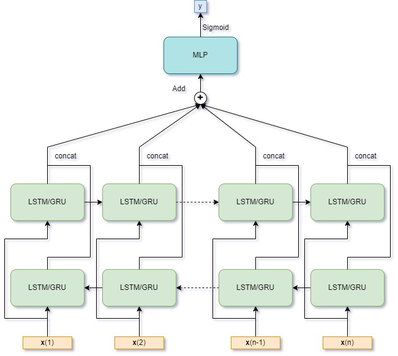
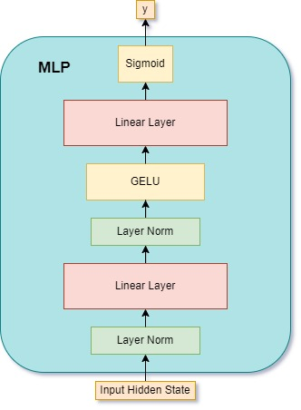
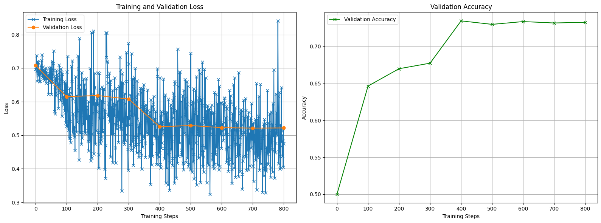
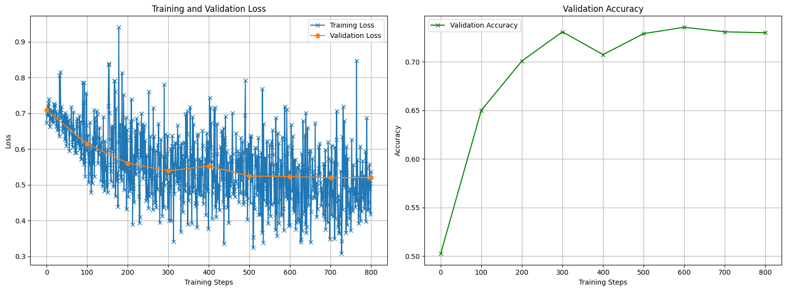
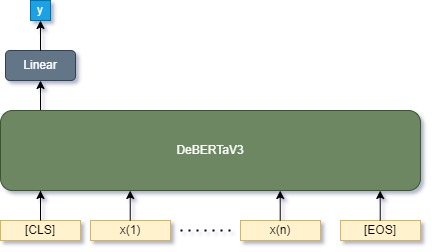
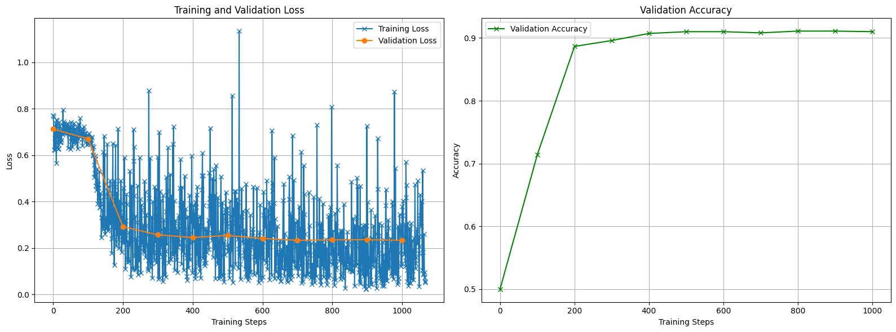

## 3.3. BiLSTM and BiGRU

      &emsp;  
     
    Figure 1. Image for BiLSTM and BiGRU for sentiment analisys

 

&emsp; In this section, we improved our model by introducing BiLSTM and BiGRU to our structure. Our structure is shown in Fig. 1. First of all, we use the Tokenizer and Embedding model defined in Part 1 to tokenize the input sentence into a word sequence and generate corresponding embedding vectors. Secondly, We use bi-directional GRU and LSTM to encode the input sequence into hidden vectors. To associate the hidden vectors from two directions, we concate the hidden vectors from each direction. Thirdly, to consider hidden vectors from all positions, we summate the hidden vectors from all positions to a summated hidden vector. Finally, an MLP module with a sigmoid activation function maps the summated hidden states to a scalar output **y** ranging from 0 to 1, which is considered as the possibility of the sentence to be positive.

&emsp; We train a BiLSTM and BiGRU separately. We use binary cross-entropy loss as our criteria, and the model is used as a binary classifier. We use AdamW as an optimizer, which is a common choice in NLP tasks. To dynamically tune the learning rate to escape the local minimum, we use a cosine scheduler with warm-up as a learning rate scheduler. 

&emsp; We define the BiGRU model with 2 GRU layers for each direction; the hidden dimension of the BiGRU model is 256. As shown in the right part of Fig. 1, The MLP structure is a three-layer neural network with a GELU activation function and a two-layer normalization module. The output activation function is a scaler of binary classification. The BiLSTM model is similar to the BiGRU model, with only the GRU layer replaced by the LSTM layer. 

&emsp; We adopted the mini-batch mechanism in our training process. However, the sentence length varies in each batch. To handle variable sentence lengths within each batch, we dynamically pad each sentence to match the length of the longest sentence in the mini-batch. This approach saves GPU memory compared to global padding, as sentences do not need to be padded to the maximum length of the training set. Additionally, we mask padding positions to exclude them from backpropagation, ensuring they do not affect gradient updates.

&emsp; The setting of training process is below (we use same setting for both BiGRU and BiLSTM):

- dropout rate: 0.1
- training epochs: 3
- batch size: 32
- learning rate (before schedule): 8e-5
- weight decay rate: 1e-5
- warm-up ratio: 0.1
- maximum gradient norm: 2.0

Dropout is applied to both the BiLSTM/BiGRU and MLP parts to enhance generalizability. We use mini-batches of size 32, with an initial learning rate of 8e-5 that the scheduler adjusts dynamically during training to help the model avoid local minima. This learning rate is the maximum rate during the warm-up phase of the scheduler, with warm-up lasting for the first 10% of the total training steps. During warm-up, the learning rate gradually increases to 8e-5 and gradually declines following a cosine decay schedule after that, enabling the model to capture basic patterns in the early stages. To prevent gradient explosion, we apply gradient clipping with a maximum gradient norm of 2.0 after each backpropagation step.

    
     
    Figure 2. Training curve for BiLSTM

    
     
    Figure 3. Training curve for BiGRU

<!-- 

Note: we may add more explaination if there are still some place left

-->

&emsp; As the training epochs is 3, in order to further track the training process, we compute loss and accuracy on the validation set every 100 steps. The outcome training curve is shown in Fig. 2. (BiLSTM) and Fig. 3. (BiGRU). The accuracy for BiLSTM and BiGRU on the test set is shown below:

- BiGRU: 0.7486

- BiLSTM: 0.7364

Compared with the RNN model, the BiGRU and the BiLSTM perform better. This may be because the GRU and LSTM modules introduce gate mechanisms to RNN-base models. The mechanism eases the gradient vanish issue of the RNN-base model. Moreover, BiGRU and BiLSTM are bi-directional. This means that each position can encode information for the whole sequence from both sides compared with the single-directional RNN model we defined previously. Comparing BiGRU and BiLSTM, the accuracy of the test set is similar. BiGRU may be slightly better, but generally speaking, BiGRU and BiLSTM obtain similar performance.

## 3.5. Improvement

    
     
    Figure 4. Structure of our BERT model

&emsp; To further improve the model, we switch from RNN-base model to Transformer-based model. The sentiment analysis task is a binary classify task with a sequence input and a scaler output. To fit the task, we decide to use BERT-like encoder only Transformer models as we do not need the decoder to generate sequence. Moreover, as the training set is reletively small, we decide to fine-tune on a pre-trained BERT-like model to gain better performance.

&emsp; In this section, we decide to use DeBERTaV3 model from Microsoft as pre-trained model. We add a linear projection layer after the output Linear layer of DeBERTaV3 to project the output vector to a scaler y as the model prediction. As DeBERTaV3 provide a special token "[CLS]" as the first token of the input sequence for classifier, we only add the linear projection layer after the output latent vector corresponding to "[CLS]" token. This is default settings of DeBERTaV3 model. The detail structure is shown in Fig. 4. Moveover, DeBERTaV3 model have more improvement comparing with our previous RNN-based model beyond change the model architecture to Transformer. The pretrained model provide subword tokenize algorithm: Word Piece tokenization as advanced tokenize algorithm.

&emsp; The training setting is similar to previous approach. We use binary cross-entropy loss as criteria, AdamW as optimizer, Cosine scheduler with warm up as learning rate scheduler. We adopted mini-batch training. As BERT model may not face severe gradient explosion problem comparing with RNN-base model, we do not utilze the gradient clip mechanism. In addition, the batch-wise padding algorithm is same as previous appoarch.

&emsp; The fine-tuning hyper-paramater settings are shown below:

- training epochs: 2
- batch size: 16
- learning rate (before schedule): 5e-6
- weight decay rate: 1e-7
- warm-up ratio: 0.05

Comparing with train from scretched RNN-base model shown previously, our fine-tune settings use fewer training epochs and smaller warm-up ratio as the pre-trained model was already learned some word meanings. We choose lower learning rate as the DeBERTV3 model has more paramater than previouse RNN-base model. In addition, we use smaller batch size to save GPU memory.

    
     
    Figure 5. Training curve for fine-tuned DeBERTaV3

&emsp; The training curve is shown in Fig. 5. The result accuracy on Test set is **0.9024**. The outcome shows that the fine-tuned DeBERTaV3 siginificantly out perform all previous model. This may becasue DeBERTaV3 is Transformer-based model with more paramaters and it has already pre-trained on large dataset so it can learn better via our small scale dataset.

